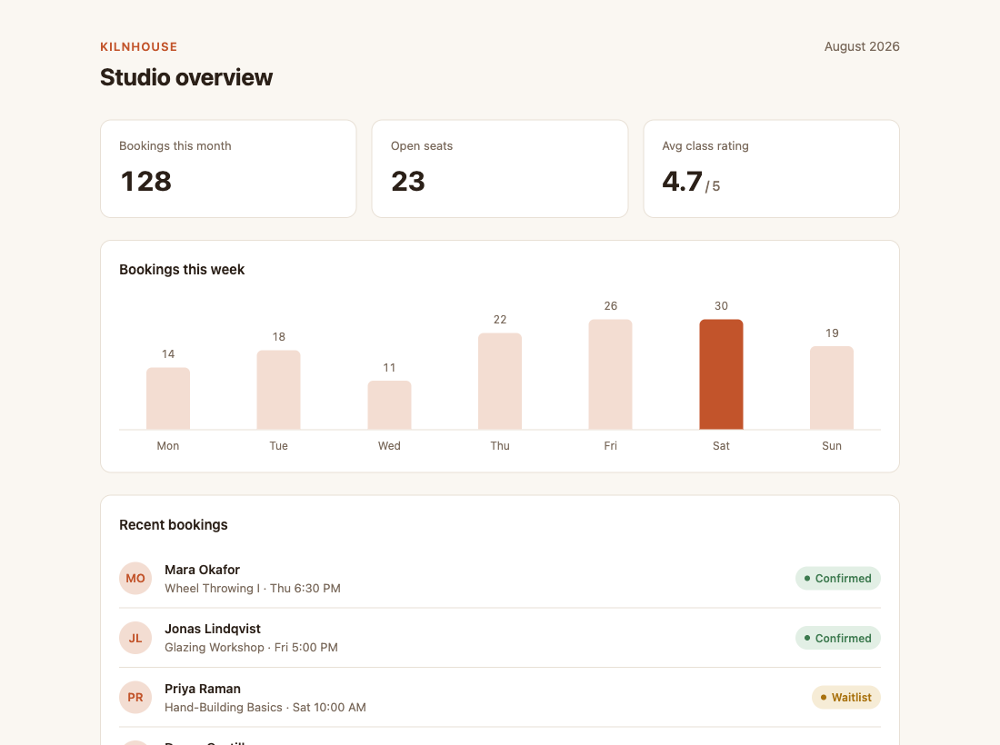
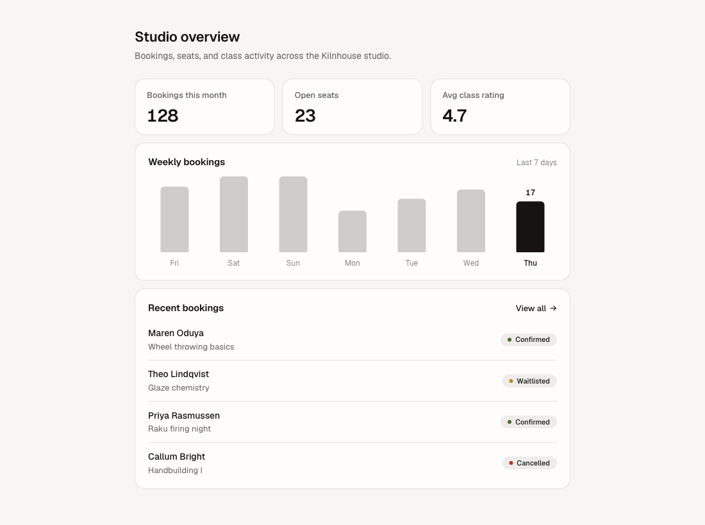
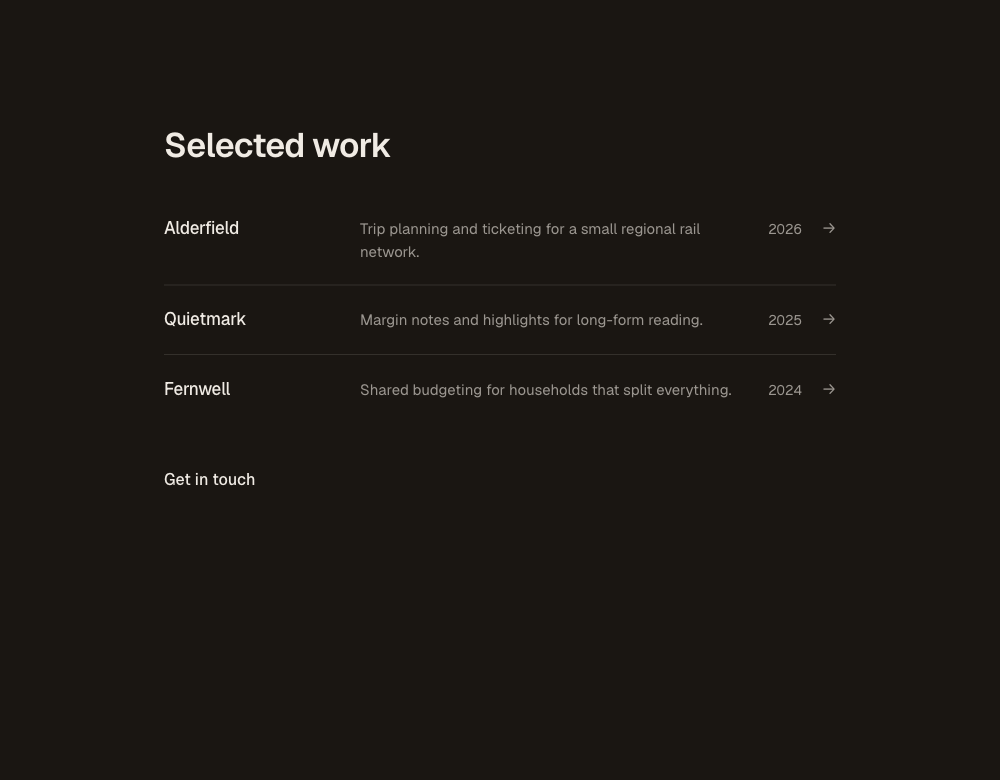
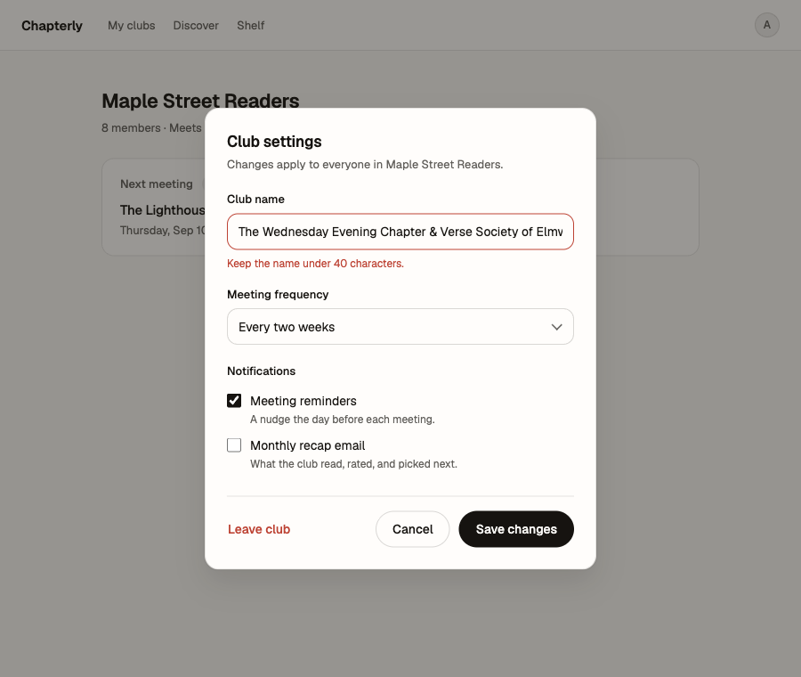
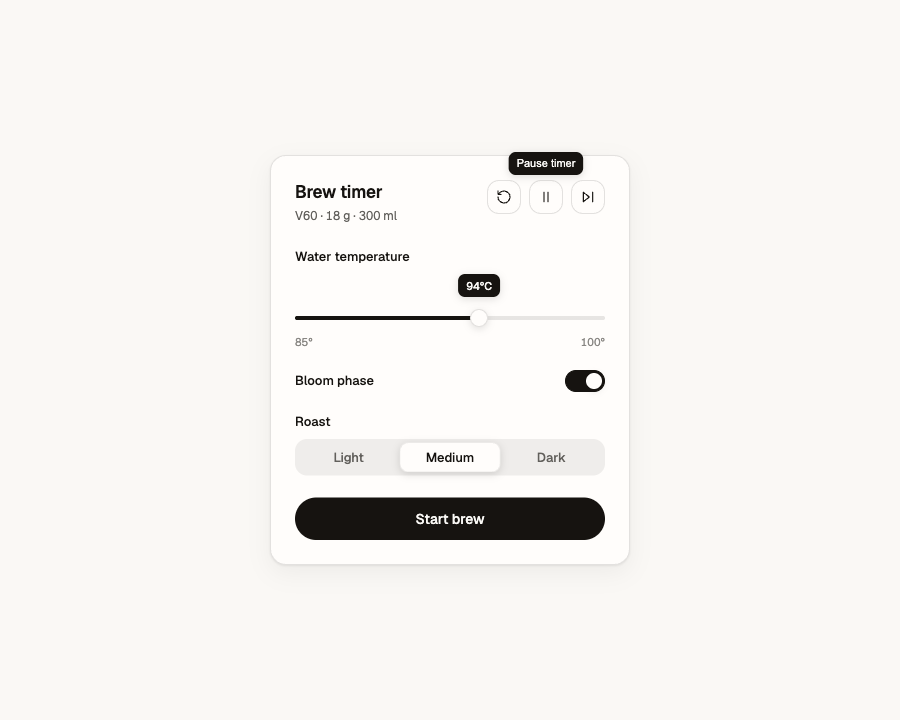
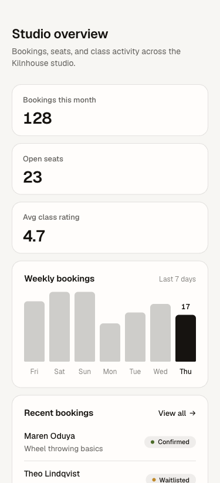
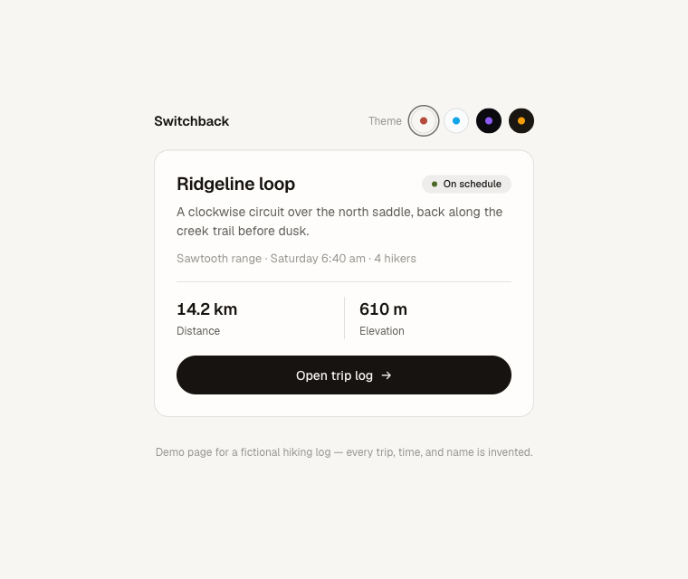
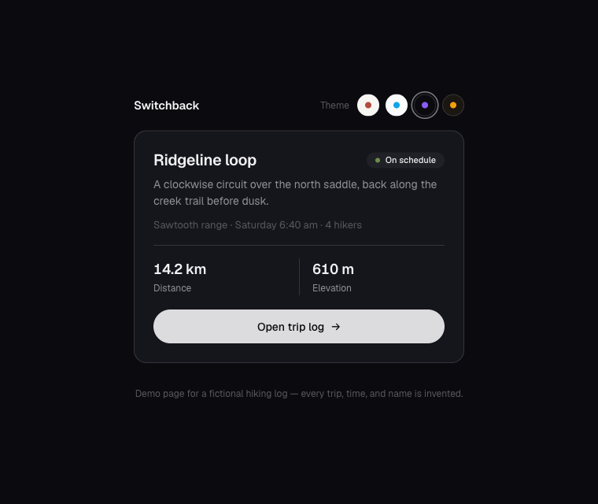

# Ali's Design

A personal design-taste skill for [Claude Code](https://claude.com/claude-code). Drop it in `~/.claude/skills/` and any agent building UI for you inherits a specific, tested aesthetic instead of the defaults every model reaches for: warm bone surfaces, near-black ink, Geist, one weighted action per screen, and motion that only exists when it carries information.

It was distilled from real shipped projects by mining session memory for every design decision I'd actually approved or rejected, then compressed into rules an agent can follow cold. The test protocol is strict: a fresh agent with zero conversation context reads only the skill and builds a component. If the output needs correction, the correction becomes a rule and the test reruns until it doesn't.

## Why a custom skill on top of other skills

The companion skills below are genuinely good, and each one is deep in a single dimension. Emil's covers motion discipline and the invisible details of component feel; apple-design covers fluid physical interaction; Hallmark covers page structure and anti-slop layout; Anthropic's cover visual direction and charts. What none of them can know is what one specific person keeps choosing, so every invocation still makes its own calls on the free variables: which neutral, which accent, which chip style, how much motion. Ask twice, get two different-looking apps. That variance is where the correction rounds go to die.

This skill is the layer that pins those variables. It routes motion questions to Emil's philosophy and gesture questions to apple-design, but the palette, type, chip anatomy, spacing rhythm, and banned list are decided in advance, from evidence, and every rule traces back to a real approval or a real rejection. The combination beats any single skill because the general expertise finally lands inside one consistent identity, and it compounds: each review I give becomes a permanent rule, so the skill gets more accurate with use instead of resetting every session.

## Before and after

Same brief, both agents, one variable. Each was asked cold for a class-booking dashboard for a fictional pottery studio; the left agent was told to use no skills at all and the right agent read `SKILL.md` and nothing else. Neither output was edited afterward. The left result is worth naming: cream ground, terracotta accent, tinted status pills, a tracked-uppercase eyebrow. That's the most statistically common AI-generated look there is, which is the point; without a taste layer, that's what you get.

| Without the skill | With the skill |
|---|---|
|  |  |

More cold builds on invented subjects, also unedited:

| | |
|---|---|
|  |  |
|  |  |

One card across three themes with zero per-theme component CSS; only the token blocks change, and each theme's accent is paired to its own ground temperature:

| Cream | Midnight | Obsidian |
|---|---|---|
|  |  |  |

## What the skill locks down

The concrete stuff lives in [SKILL.md](SKILL.md); the short version is a warm OKLCH token system where every state derives via `color-mix`, a Geist-first type stack in sentence case, hairlines over shadows, two sanctioned chip patterns (colored outline for identity, neutral fill with a 6px semantic dot for status), custom tooltips because native `title` is banned, sliders that track the pointer 1:1, and an easing system built around `cubic-bezier(0.16, 1, 0.3, 1)` with reduced-motion handled everywhere. There's also a banned list of verbatim rejections. Standalone status dots. Saturated badge fills. A cool accent dropped raw onto a warm page. `transition: all`.

## What the skill asks about

Some axes are taste; others are per-project freedom, and an agent guessing on those is how you end up with a serif font you never asked for. So the skill splits them. Locked taste never gets questioned. Five open axes (display voice, accent hue, theme scope, signature element, motion register) trigger one batch of questions with recommended defaults before any CSS gets written. When no human is reachable, the agent takes the defaults and must open its reply by declaring them, because a silent assumption on an open axis counts as a failure even when the default was right.

## Prerequisites

`alis-design` works on its own, but it names companion skills and expects them for full effect, especially the motion passes. Install these first:

- **emil-design-eng** and **apple-design**, from [emilkowalski/skills](https://github.com/emilkowalski/skills). The first encodes [Emil Kowalski](https://emilkowal.ski/)'s design engineering philosophy from [animations.dev](https://animations.dev/); it's where the press-scale, tooltip-timing, and "should this animate at all" discipline comes from, and this skill requires it for any motion or interaction pass. The second distills Apple's WWDC design talks (chiefly *Designing Fluid Interfaces*, 2018) into web terms, and it's required whenever gestures, springs, translucent materials, or reduced-motion behavior are in scope.

  ```bash
  git clone https://github.com/emilkowalski/skills /tmp/emil-skills
  cp -r /tmp/emil-skills/skills/emil-design-eng /tmp/emil-skills/skills/apple-design ~/.claude/skills/
  ```

- **hallmark**, from [nutlope/hallmark](https://github.com/nutlope/hallmark) (powered by Together AI). An anti-slop page-structure skill used for greenfield pages and landing pages. Where its palette or type picks conflict with this skill, this skill wins.

  ```bash
  npx skills add nutlope/hallmark
  ```

- **frontend-design**, Anthropic's official plugin from [anthropics/claude-code](https://github.com/anthropics/claude-code/tree/main/plugins/frontend-design), installable through the Claude Code plugin marketplace. Used for fresh visual direction on new surfaces.

- **dataviz**, from Anthropic's public skills repo at [anthropics/skills](https://github.com/anthropics/skills). Required for any chart or dashboard tile.

Credit where it's due: this skill stands on those. It contributes the part they can't, which is what one specific person keeps choosing.

## Install

With the prerequisites in place:

```bash
mkdir -p ~/.claude/skills/alis-design
curl -fsSL https://raw.githubusercontent.com/neanicc/alis-design/main/SKILL.md \
  -o ~/.claude/skills/alis-design/SKILL.md
```

Or clone and copy. Reload skills (or restart Claude Code) and it auto-triggers on UI work; `/alis-design` invokes it directly.

## Samples

The five demo files in [`samples/`](samples/) are actual cold-build outputs from testing, kept unedited and set on invented subjects: a pottery-studio booking dashboard, a dark portfolio section, a book-club settings modal, a brew-timer card with tooltips and a slider, and a four-theme hiking-log switcher. Each is a single self-contained HTML file; open it in a browser. The themes one persists your pick in localStorage and eases the switch only during the change, never on load.

## How it got its rules

Seven correction rounds so far, each one anchored to a real piece of feedback and verified by rerunning the same brief cold:

| Round | Correction | Rule that came out of it |
|---|---|---|
| 1 | Baseline profile mined from memory across four projects | The token system, type, motion, spacing, banned list |
| 2 | "The blue does not match at all with the rest of the page" | Accent harmony: accents share the ground's temperature or get ink-mixed |
| 3 | A status pill from an earlier project, screenshot as spec | Neutral pill + 6px semantic dot for workflow states |
| 4 | "This is what I see rn. Is this correct or did u copy it wrong?" | Screenshot beats documentation: pills are borderless soft fill, not hairline outline |
| 5 | Tooltips and sliders weren't covered | Floating layers and controls section; native `title` banned |
| 6 | Multi-theme sites should re-harmonize, not hardcode | Theming section with per-theme accents and eased switching |
| 7 | "It shouldn't assume Playfair for the title" | Open axes: ask before assuming, declare defaults when you can't ask |

The white-button round hides inside 6: on dark themes the primary pill is the ink token mixed 90 to 93 percent toward the ground, never pure `#fff`, because a stark white pill glows against a dark surface and reads as pasted-in.
