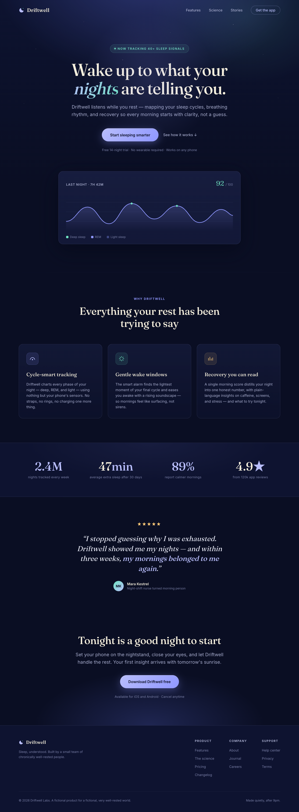
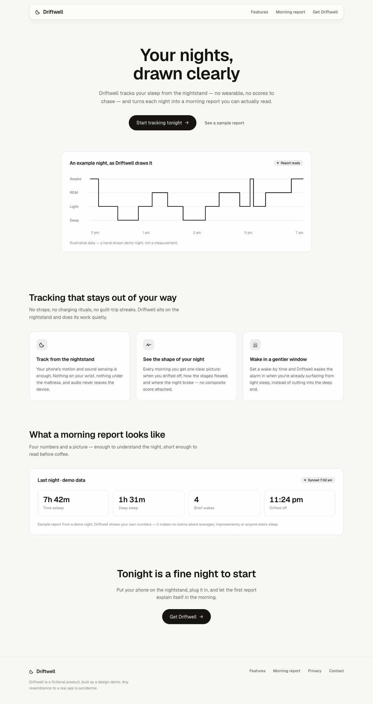

# Ali's Design

A personal design-taste skill for [Claude Code](https://claude.com/claude-code). Drop it in `~/.claude/skills/` and any agent building UI for you inherits a specific, tested aesthetic instead of the defaults every model reaches for: warm bone surfaces, near-black ink, Geist, one weighted action per screen, and motion that only exists when it carries information.

It was distilled from real shipped projects by mining session memory for every design decision I'd actually approved or rejected, then compressed into rules an agent can follow cold. The test protocol is strict: a fresh agent with zero conversation context reads only the skill and builds a component. If the output needs correction, the correction becomes a rule and the test reruns until it doesn't.

## Why a custom skill on top of other skills

The companion skills below are genuinely good, and each one is deep in a single dimension. Emil's covers motion discipline and the invisible details of component feel; apple-design covers fluid physical interaction; Hallmark covers page structure and anti-slop layout; Anthropic's cover visual direction and charts. What none of them can know is what one specific person keeps choosing, so every invocation still makes its own calls on the free variables: which neutral, which accent, which chip style, how much motion. Ask twice, get two different-looking apps. That variance is where the correction rounds go to die.

This skill is the layer that pins those variables. It routes motion questions to Emil's philosophy and gesture questions to apple-design, but the palette, type, chip anatomy, spacing rhythm, and banned list are decided in advance, from evidence, and every rule traces back to a real approval or a real rejection. The combination beats any single skill because the general expertise finally lands inside one consistent identity, and it compounds: each review I give becomes a permanent rule, so the skill gets more accurate with use instead of resetting every session.

## Before and after

One brief, two agents, one variable. Both were asked cold for a marketing frontpage for Driftwell, a fictional sleep-tracking app. The first agent was told to use no skills at all; the second read `SKILL.md` and nothing else. Neither page was edited afterward.

| Without the skill | With the skill |
|---|---|
|  |  |

**Left:** a deep-navy gradient with a CSS star field, a serif headline with one word italicized for emphasis, four accent colors, an uppercase tracked badge, a lavender pill, and further down a stat strip claiming 2.4M tracked nights and 4.9 stars from 120k reviews of an app that does not exist. Competently built, and recognizable as AI output from across the room.

**Right:** warm bone ground, Geist, a glass nav, one ink pill, a single accent used only where it earns it, and a hand-drawn hypnogram labeled as illustrative data; every number below the fold is framed as a demo report rather than a claim. The screenshots only show the first fold; open [`samples/landing-with-skill.html`](samples/landing-with-skill.html) live for the part a still can't carry, because the motion is where it feels finished: a one-shot entrance, a floating nav that eases into a full-width bar once you scroll, press-scale on the pill, hover nudges, all on the skill's easing system and all gone under reduced-motion.

## What the skill locks down

The concrete stuff lives in [SKILL.md](SKILL.md); the short version is a warm OKLCH token system where every state derives via `color-mix`, a Geist-first type stack in sentence case, hairlines over shadows, two sanctioned chip patterns (colored outline for identity, neutral fill with a 6px semantic dot for status), custom tooltips because native `title` is banned, a custom combobox dropdown because a native select's open menu can't be styled, sliders that track the pointer 1:1, and an easing system built around `cubic-bezier(0.16, 1, 0.3, 1)` with reduced-motion handled everywhere. There's also a banned list of verbatim rejections. Standalone status dots. Saturated badge fills. A cool accent dropped raw onto a warm page. `transition: all`.

## What the skill asks about

Some axes are taste; others are per-project freedom, and an agent guessing on those is how you end up with a serif font you never asked for. So the skill splits them. Locked taste never gets questioned. Five open axes (display voice, accent hue, theme scope, signature element, motion register) trigger one batch of questions with recommended defaults before any CSS gets written. When no human is reachable, the agent takes the defaults and must open its reply by declaring them, because a silent assumption on an open axis counts as a failure even when the default was right.

## Prerequisites

`alis-design` works on its own, but it names companion skills and expects them for full effect, especially the motion passes. Install these first:

- **emil-design-eng** and **apple-design**, from [emilkowalski/skills](https://github.com/emilkowalski/skills). The first encodes [Emil Kowalski](https://emilkowal.ski/)'s design engineering philosophy from [animations.dev](https://animations.dev/); it's where the press-scale, tooltip-timing, and "should this animate at all" discipline comes from, and this skill requires it for any motion or interaction pass. The second distills Apple's WWDC design talks (chiefly *Designing Fluid Interfaces*, 2018) into web terms, and it's required whenever gestures, springs, translucent materials, or reduced-motion behavior are in scope.

  ```bash
  git clone https://github.com/emilkowalski/skills /tmp/emil-skills
  cp -r /tmp/emil-skills/skills/emil-design-eng /tmp/emil-skills/skills/apple-design ~/.claude/skills/
  ```

- **hallmark**, from [nutlope/hallmark](https://github.com/nutlope/hallmark) (powered by Together AI). An anti-slop page-structure skill used for greenfield pages and landing pages. Where its palette or type picks conflict with this skill, this skill wins.

  ```bash
  npx skills add nutlope/hallmark
  ```

- **frontend-design**, Anthropic's official plugin from [anthropics/claude-code](https://github.com/anthropics/claude-code/tree/main/plugins/frontend-design), installable through the Claude Code plugin marketplace. Used for fresh visual direction on new surfaces.

- **dataviz** ships built into Claude Code, so there's nothing to install; the skill routes chart and dashboard-tile work to it automatically.

This skill wouldn't be possible without those. Emil's motion discipline, the Apple fluidity rules, and Hallmark's structural anti-slop gates are the expertise it builds on; all it adds is the personal layer they can't know. If you use it, go star [emilkowalski/skills](https://github.com/emilkowalski/skills), [nutlope/hallmark](https://github.com/nutlope/hallmark), and Anthropic's [claude-code](https://github.com/anthropics/claude-code) and [skills](https://github.com/anthropics/skills) repos. They earned it.

## Install

With the prerequisites in place:

```bash
mkdir -p ~/.claude/skills/alis-design
curl -fsSL https://raw.githubusercontent.com/neanicc/alis-design/main/SKILL.md \
  -o ~/.claude/skills/alis-design/SKILL.md
```

Or clone and copy. Reload skills (or restart Claude Code) and it auto-triggers on UI work; `/alis-design` invokes it directly.

## Samples

Both Driftwell pages live in [`samples/`](samples/) (`landing-no-skill.html` and `landing-with-skill.html`), alongside more cold-build outputs on invented subjects: a pottery-studio booking dashboard, a book-club settings modal with the custom dropdown, a brew-timer card with tooltips and a slider, and a four-theme hiking-log switcher. Each is a single self-contained HTML file; open it in a browser. The themes one persists your pick in localStorage and eases the switch only during the change, never on load.
